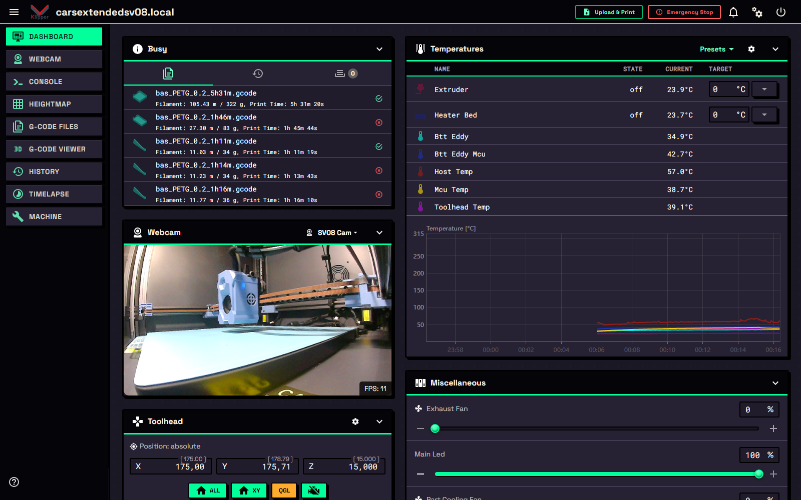
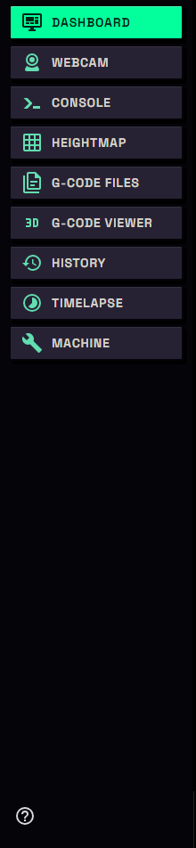
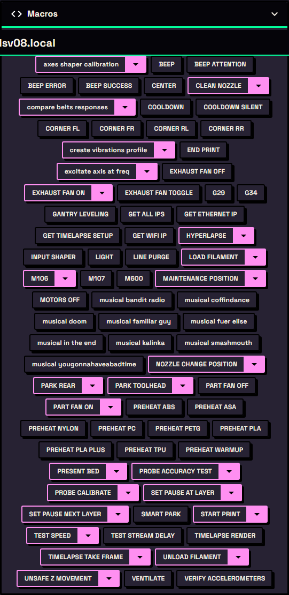
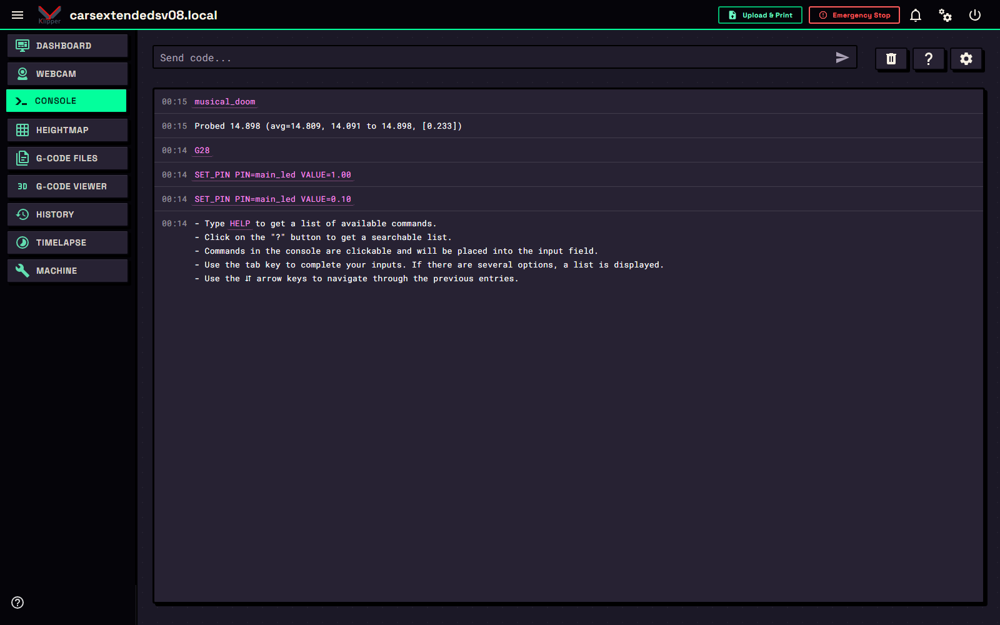
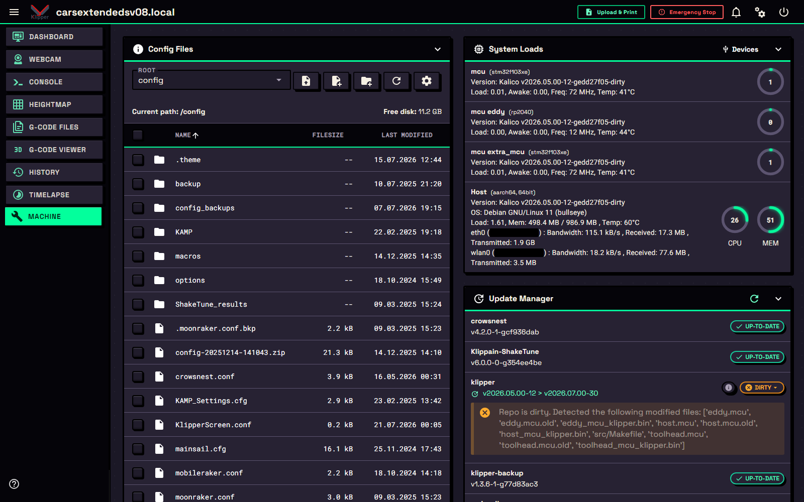
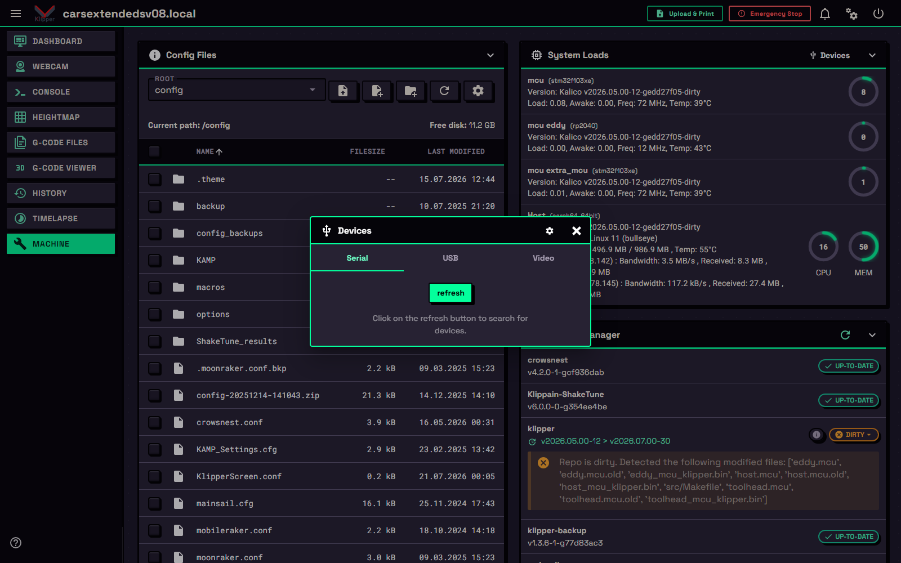
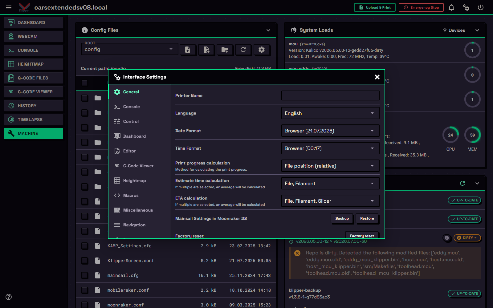
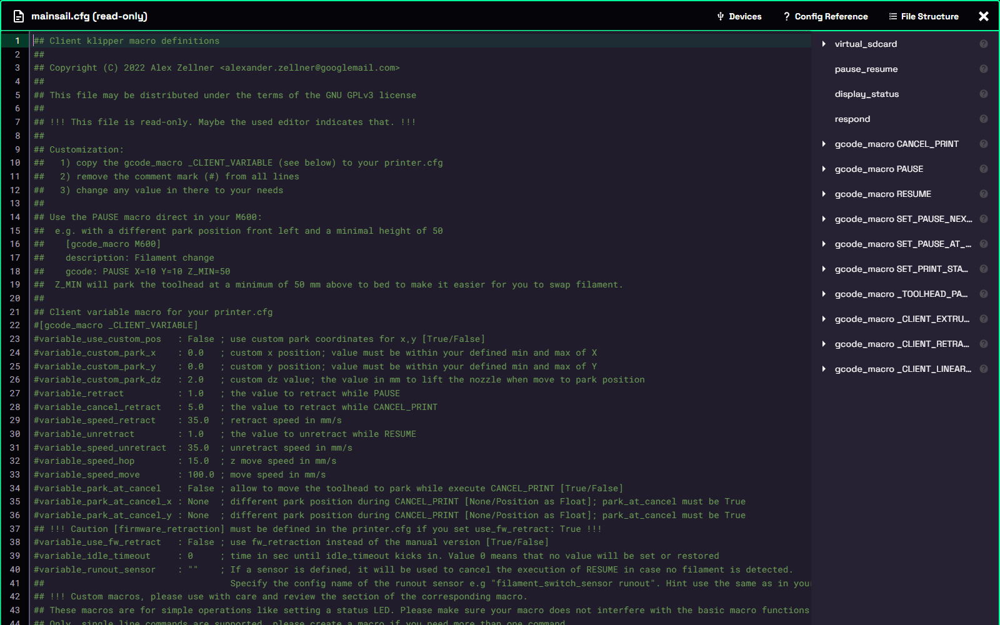

# NEONOIR 

Neo-Brutalism on Mainsail!
Made to be personalized, compiled through SCSS!



### Setting Primary

Open **Settings → Interface** and set:

- **Primary Color** → `#7316fd`

This will be the primary used throughout the theme

---

### Making it your own
This theme was build from the ground up with customizability in mind
meaning changing colors is a breeze!

# shallow customization  
if you don't want to make deep changes you only should really touch [_token.scss](src/_tokens.scss)
there you can easily change colors, override a color or even change how the complementary color is set

# deep customization
every file with _ has a important bit of mainsail styling, if you for example want to change the console input to be more round,
you'd need to modify [_content.scss](src/_content.scss) and find "a.command, .console a.command, .consoleTableRow a.command" and
set border-radius to whatever you want.
you can write normal CSS or use more advanced SCSS features
SCSS Docs: https://sass-lang.com/guide/

## creating a new css for mainsail using node

you will need nodejs for the next part, so download using your package manager like apt (sudo apt install nodejs) or visit the nodejs website

```bash
# assuming you have just cloned it off github and that its at your users directory
cd NeoNoirMainsailTheme

# install packages via npm
npm install

# run command to create a new custom.css
npm run build

# move generated files into mainsails theme folder (assuming your klipper files are at printer_data)
mkdir -p /home/$USER/printer_data/config/.theme && cp -rf .theme/. /home/$USER/printer_data/config/.theme/
```

running the command above should instantly change the style, if it bugs around press control + shift + r to hard reload


--- 

## Gallery

| | |
|---|---|
|  **Sidebar** |  **Macros**  |
|  **Console**  |  **Machine**  |
|  **Devices** |  **Settings** |
|  **Config editor**  | |


---


*Share and remix freely.*
